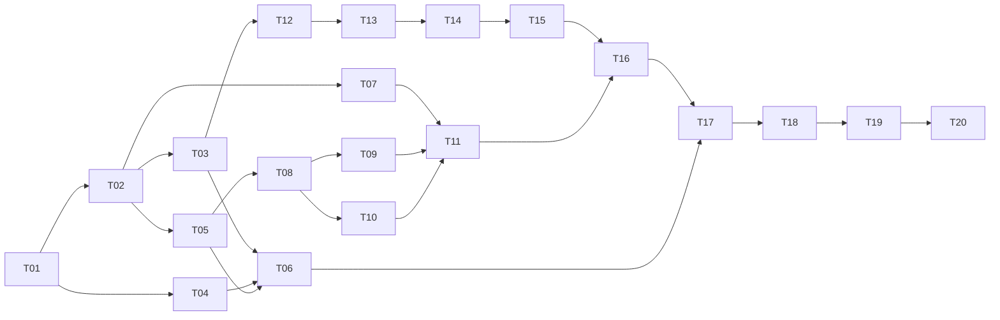

# Hexo Send 技术架构与开发任务计划

- 日期：2026-08-08
- 状态：可进入开发，尚未开始编码
- 项目目录：`D:\WorkDev\MyShare\obsidian-hexo-send`
- 产品依据：`D:\WorkDev\MyShare\.omx\plans\2026-08-08-obsidian-hexo-publisher-product-plan.md`
- MVP 平台：Windows 桌面版 Obsidian

## 1. 目标与边界

本项目实现一个桌面端 Obsidian 插件：从文件、目录、多选或当前笔记发起“预发布”，将源 Markdown 转换为符合目标 Hexo 仓库规则的文章，完成两阶段 Hexo 校验并创建一个精确的本地 Git commit。Push 必须在结果页由用户再次确认。

以下约束是不可关闭的系统不变量：

1. 不修改 Obsidian 源笔记，只读取源文件和附件。
2. 不执行 `hexo deploy`，不读取 GitHub Actions，不判断站点是否上线。
3. 一次预发布最多创建一个 commit；commit 前不进行网络写操作。
4. Push 与预发布任务分离，只有用户在结果页明确点击 Push 才执行。
5. 只 stage 执行计划列出的目标文章和图片，禁止 `git add .`。
6. 已有 staged changes、Git 操作中间态或 `index.lock` 会阻止 commit。
7. AI 仅用于补齐候选元数据；没有 AI 时，完整流程仍可通过人工表单完成。

产品方案中这些约束分别来自第 6、42、55、68–78、130–143、174、220 行附近。MVP 不包含 URL 抓取、对话汇总、多博客、移动端、部署跟踪和复杂 Obsidian 语法转换。

## 2. 架构决策摘要

### 2.1 分层方案

采用“领域核心 + 应用编排 + 基础设施适配器 + Obsidian UI”的单插件模块化架构：

```text
Obsidian 菜单 / Modal / 设置页
                 │
                 ▼
         Application 用例与任务编排
                 │
       ┌─────────┴─────────┐
       ▼                   ▼
纯 Domain 规则       Port 接口（系统能力）
                           │
             ┌─────────────┼─────────────┐
             ▼             ▼             ▼
          Hexo CLI       Git CLI      文件/网络/AI
```

选择理由：领域规则可在没有 Obsidian、Git、Hexo 和网络的环境中进行快速单元测试；外部命令、文件写入和 Push 被限制在少量适配器内；UI 只负责采集确认和展示状态，不复制业务判断。

不采用以下方案：

- 单个 `main.ts` 串行脚本：实现快，但难以验证批量回滚、精确 stage、取消和重试。
- 直接复用 `/hexo-send` 脚本：该技能包含 URL/对话入口、默认 AI 和部分自动 push 行为，与插件已确定的交互和安全边界不同；本项目复用领域规则，不直接调用技能脚本。
- 通过临时 Git worktree 执行：隔离性强，但当前分支占用、临时分支、用户未提交内容和 Windows 路径处理会显著增加 MVP 复杂度。首版在真实 Hexo 工作区执行，但使用基线快照、允许变更集合和任务日志保护。

### 2.2 技术栈

- TypeScript 严格模式，目标为 Obsidian 当前桌面运行时支持的 ECMAScript 版本。
- 官方 `obsidian` API：菜单、命令、Modal、SettingTab、Vault/MetadataCache、SecretStorage。
- esbuild：插件打包；输出 `main.js`、`manifest.json`、`styles.css`。
- `yaml`：解析和按固定字段顺序序列化 frontmatter。
- `zod`：设置、检测结果、AI JSON 和持久化数据的运行时校验。
- Node `child_process.spawn`/`execFile`、`fs/promises`、`path`、`crypto`：桌面系统能力。
- Vitest：领域和应用层单元测试；临时目录中的真实 Git 集成测试。
- ESLint + Prettier + `tsc --noEmit`：静态质量门。

不引入 `simple-git` 或 shell 拼接库。Git/Node/npx 的退出码、stdout、stderr、超时、取消和参数必须由统一 `ProcessRunner` 控制。

### 2.3 核心数据模型

- `SourceSelection`：用户原始选择，保留文件/目录来源。
- `SourceArticle`：解析后的源路径、正文、候选 frontmatter、图片引用和不支持语法。
- `ArticleDraft`：经过本地规则或 AI/人工补齐、但尚未确认的候选文章。
- `ReviewedArticle`：用户已确认分类和元数据，冲突策略明确。
- `PublishPlan`：不可变执行计划，包含目标路径、动作、允许写入路径、预计 commit message 和基线指纹。
- `PublishJob`：任务 ID、状态、进度、AbortSignal、阶段结果和诊断事件。
- `ChangeManifest`：本次允许新增/更新/stage 的规范化仓库相对路径集合。
- `PublishResult`：文章、图片、abbrlink、commit、警告与失败的结构化结果。
- `PushRequest`：commit hash、remote、branch；执行前必须与当前 HEAD 和 upstream 再核对。

`PublishPlan` 一经进入 `generating` 状态便不能由 UI 原地修改。任何修改都回到预览阶段重新生成计划，避免“预览内容”和“实际提交内容”漂移。

### 2.4 状态机与事务边界

状态严格遵循：

```text
scanning → enriching → awaiting_review → generating → validating
         → committing → committed → pushing → pushed

提交前可终止：cancelled / validation_failed / commit_failed
提交后可终止：push_failed
```

执行顺序：

1. 再次执行环境与 Git 写入前检查，确认设置页检测结果没有过期。
2. 创建任务日志，记录 Git HEAD/status、目标文件基线哈希和 `ChangeManifest`。
3. 将无 abbrlink 的文章副本写入目标仓库；更新文章先保存可恢复备份。
4. 运行第一次 `hexo clean` 与 `hexo generate --bail`，读取并校验每篇 abbrlink。
5. 复制/下载图片、补齐 alt、改写正文，回填 `top_img` 与 `cover`。
6. 运行第二次 `hexo generate --bail`。
7. 比较 Git 变更与基线；出现计划外 source 变更时停止，不 commit。
8. 使用逐路径 `git add -- <path...>`，随后核对 staged 路径集合必须与 `ChangeManifest` 完全一致。
9. 执行一次 `git commit -m ...`，读取 hash，并核对 commit tree 中的路径集合。
10. 展示“已提交，尚未推送”。Push 是新的显式用例，执行前确认 HEAD、remote、branch 和 hash 仍匹配。

批量任务默认全有或全无。若用户在失败结果页选择“只提交成功项”，应用层会先按 journal 恢复失败任务写入，再排除失败文章，重新生成一份 `PublishPlan` 并重新执行两阶段校验；不能复用部分失败任务留下的文件或验证结论。

取消采用协作式 `AbortController`：扫描、AI、下载、两次 generate 之间均可取消；进入精确 stage/commit 临界区后按钮显示“正在提交，无法取消”，避免产生不明确的 Git 状态。

### 2.5 文件安全与恢复

- 对已存在路径使用 `realpath`；对新文件使用已存在父目录的 `realpath`，再进行大小写不敏感的仓库包含性检查。
- 拒绝 `..` 逃逸、符号链接逃逸、Windows 保留名和目标仓库之外的写入。
- 任务临时数据位于系统临时目录 `obsidian-hexo-send/<job-id>/`，包含 journal、目标旧版本备份和脱敏日志；不复制 API key。
- 校验失败默认保留 Hexo 工作区现场供诊断，并在结果页提供“恢复本次改动”。恢复只处理 journal 中的路径；若文件当前哈希已不等于插件最后写入哈希，则拒绝覆盖并提示人工处理。
- 插件启动时发现未完成 journal，只提示恢复/打开目录/忽略，不自动删除或覆盖文件。
- 成功 commit 后清除内容备份，仅保留不含正文和秘密的结果摘要；陈旧临时任务按 7 天清理。

### 2.6 日志与秘密

- 所有服务产出结构化 `DiagnosticEvent`；UI 可复制脱敏后的阶段、命令名、退出码和 stderr 摘要。
- 日志不记录文章全文、HTTP Authorization、API key、SecretStorage 值或带凭证 URL。
- `data.json` 只保存非秘密设置和 AI secret 的逻辑键名；真实 key 只存 SecretStorage。
- 对进程环境采用允许列表传递，日志展示命令时只展示可执行文件和已脱敏参数。

### 2.7 确定性命名规则

- 单篇 commit message：`post: <title>`，整体最多 72 个字符。
- 批量 commit message：`post: <第一篇 title> 等 N 篇`，整体最多 72 个字符；预览中允许用户编辑，但必须非空且通过长度校验。
- 更新文章的图片目录沿用原 abbrlink。MVP 只覆盖本次同名编号图片，不自动删除目录中未被新正文引用的旧图片，避免误删人工维护资产；结果页报告可能的孤立图片，清理功能后置。

## 3. 拟议项目结构

本轮仅创建本计划文件，不创建下列源码；目录会由骨架任务建立。

```text
obsidian-hexo-send/
├─ manifest.json
├─ versions.json
├─ package.json
├─ tsconfig.json
├─ esbuild.config.mjs
├─ eslint.config.mjs
├─ vitest.config.ts
├─ styles.css
├─ README.md
├─ docs/
│  ├─ architecture.md
│  ├─ test-matrix.md
│  └─ plans/
│     └─ 2026-08-08-technical-development-plan.md
├─ src/
│  ├─ main.ts
│  ├─ domain/
│  │  ├─ publish-types.ts
│  │  ├─ publish-state-machine.ts
│  │  ├─ frontmatter.ts
│  │  ├─ category.ts
│  │  ├─ target-path.ts
│  │  └─ errors.ts
│  ├─ application/
│  │  ├─ scan-selection.ts
│  │  ├─ prepare-drafts.ts
│  │  ├─ create-publish-plan.ts
│  │  ├─ execute-publish.ts
│  │  ├─ push-commit.ts
│  │  ├─ recover-job.ts
│  │  └─ publish-coordinator.ts
│  ├─ ports/
│  │  ├─ process-runner.ts
│  │  ├─ file-system.ts
│  │  ├─ metadata-provider.ts
│  │  ├─ secret-store.ts
│  │  └─ job-journal.ts
│  ├─ infrastructure/
│  │  ├─ process/node-process-runner.ts
│  │  ├─ hexo/hexo-config-reader.ts
│  │  ├─ hexo/hexo-service.ts
│  │  ├─ hexo/environment-detector.ts
│  │  ├─ git/git-service.ts
│  │  ├─ files/safe-file-system.ts
│  │  ├─ files/temp-job-journal.ts
│  │  ├─ markdown/source-parser.ts
│  │  ├─ assets/asset-service.ts
│  │  └─ ai/openai-compatible-provider.ts
│  ├─ obsidian/
│  │  ├─ menu-registration.ts
│  │  ├─ settings-tab.ts
│  │  ├─ secret-storage-adapter.ts
│  │  └─ vault-source-adapter.ts
│  └─ ui/
│     ├─ publish-preview-modal.ts
│     ├─ publish-progress-modal.ts
│     ├─ publish-result-modal.ts
│     ├─ conflict-modal.ts
│     └─ components/
└─ tests/
   ├─ unit/
   ├─ integration/
   ├─ fixtures/
   │  ├─ vault/
   │  ├─ hexo-repo/
   │  └─ command-results/
   └─ manual/
      └─ desktop-smoke-checklist.md
```

依赖方向固定为：`domain <- application <- obsidian/ui`，`application -> ports <- infrastructure`。`domain` 禁止导入 `obsidian`、Node 文件系统、网络或 child process。

## 4. 模块职责与接口边界

### 4.1 Obsidian 接入层

- 注册 `file-menu`、`files-menu` 和当前笔记命令；统一转换为 `SourceSelection[]`。
- 目录递归通过 Vault API 枚举，应用排除规则，去重重叠选择并按规范路径排序。
- 维护单实例 `PublishCoordinator`；已有活动任务时提示用户查看当前任务，不暗中排队。
- 插件卸载时注销事件；有外部进程运行时请求取消并保留 journal。

### 4.2 内容与元数据

- 分离 YAML frontmatter 与正文，源 YAML 只作为候选输入。
- 固定输出字段顺序：title、date、comments、categories、tags、keywords、abbrlink、top_img、cover、description。
- 本地校验先运行；只有缺字段且启用 AI 时才请求模型。
- AI 输出经 schema、长度、分类集合和 tags 数量校验后仍只是候选值。
- AI 缓存键为 `SHA-256(规范化正文 + 分类指纹 + model + promptVersion)`，缓存不含 secret。
- 分类集合合并 `_config.yml:category_map` 与现有文章分类；保留层级数组，显示名和存储值分离。

### 4.3 Hexo 检测与执行

- 检测服务只读读取 `_config.yml`、`package.json`、目录和 Git 信息，输出 `pass/warning/failure` 以及修复建议。
- Hexo 服务不接受任意命令字符串，只暴露 `clean()` 和 `generate({bail:true})`。
- 每次执行记录 executable、cwd、时长、退出码和截断后的脱敏输出。
- abbrlink 必须从第一次 generate 后的目标 Markdown 重新读取；非空且批次内唯一。
- 第二次 generate 后重新检查目标 Markdown 和本地图片存在性。

### 4.4 图片服务

- 首版识别 Markdown 图片和 Obsidian wiki 图片嵌入；本地附件通过 Vault 解析为真实文件。
- 远程下载使用超时、最大响应体、重定向上限和 MIME/扩展名校验；代理为可选设置。
- 文件按正文出现顺序稳定编号，保留可信扩展名；同一源资源在同篇文章中去重。
- 空 alt 进入人工检查项；不得自动生成无依据描述并静默通过。
- 普通 wikilink、笔记嵌入、Dataview、Canvas、Excalidraw 输出带行号的警告/阻止项。

### 4.5 Git 服务

只暴露窄接口：`inspect()`、`stageExact(paths)`、`verifyIndex(paths)`、`commit(message)`、`inspectCommit(hash)`、`pushConfirmed(request)`。所有路径为仓库相对路径并用 `--` 分隔选项。

写入前检查包括：仓库有效、身份有效、HEAD/branch/upstream、index lock、merge/rebase/cherry-pick/revert/bisect 状态、staged 集合为空。工作区其他 unstaged 文件允许存在，但目标路径与用户已有改动重叠时阻止该文章，计划外变更永不 stage。

Push 使用检测出的 remote 和显式 refspec，不执行 force，不自动设置 upstream；push 失败保留 commit 并返回可重试结果。

## 5. 开发任务、依赖与交付物

### M0：工程与契约

| ID | 任务 | 依赖 | 主要交付物 | 完成证据 |
|---|---|---|---|---|
| T01 | 建立 Obsidian TypeScript 框架、desktop-only manifest、构建/检查/测试脚本 | 无 | 根配置、`src/main.ts`、CI 本地脚本 | `npm run build`、`npm run typecheck`、空测试套件均通过 |
| T02 | 定义领域模型、错误分类、状态机和 Port 接口 | T01 | `src/domain/*`、`src/ports/*` | 状态迁移、非法迁移和序列化单测通过 |
| T03 | 实现统一 ProcessRunner、脱敏日志、超时与取消 | T02 | process adapter | 参数不经 shell；成功/失败/超时/取消测试通过 |

### M1：设置与环境检测

| ID | 任务 | 依赖 | 主要交付物 | 完成证据 |
|---|---|---|---|---|
| T04 | 设置 schema、迁移、SecretStorage 适配器 | T01、T02 | settings store、secret adapter | data.json 无 key；旧/坏设置可安全回退 |
| T05 | 解析 Hexo 配置、package、目录、分类与文章词云 | T02 | Hexo readers | fixture 中站点、目录、分类层级、abbrlink 配置解析正确 |
| T06 | Git/Node/Hexo/pre-commit 只读诊断和设置页回显 | T03、T04、T05 | detector、settings UI | pass/warning/failure、重新检测、复制脱敏诊断可用 |

### M2：扫描、元数据与预览

| ID | 任务 | 依赖 | 主要交付物 | 完成证据 |
|---|---|---|---|---|
| T07 | 注册文件/目录/多选/当前笔记入口；递归扫描、排除、去重、取消 | T01、T02 | menu adapter、scan use case | 100 篇 fixture 可逐项进度和取消；非 md 过滤正确 |
| T08 | 解析 frontmatter、图片、unsupported syntax；规范化输出元数据 | T02、T05 | markdown parser、domain rules | 字段顺序、tags、description、日期和行号测试通过 |
| T09 | 实现 AI provider、schema 校验、并发 2、缓存和人工降级 | T03、T04、T08 | metadata provider | 无 AI/失败/非法 JSON/low confidence 均能回到可编辑状态 |
| T10 | 目标路径、分类路由、冲突策略、更新保留 abbrlink/date | T05、T08 | target resolver | 新增/更新/另存/跳过及 Windows 路径边界测试通过 |
| T11 | 单篇与批量预览 UI、逐篇/批量分类、元数据编辑、计划固化 | T07–T10 | preview/conflict modals、`PublishPlan` | 未确认分类不能执行；预览字段与计划完全一致 |

### M3：可验证的生成事务

| ID | 任务 | 依赖 | 主要交付物 | 完成证据 |
|---|---|---|---|---|
| T12 | 安全文件系统、路径包含检查、journal、备份和保守恢复 | T02、T03 | filesystem/journal/recovery | 路径逃逸被拒；崩溃 journal 可发现；并发改动不被覆盖 |
| T13 | 本地/远程图片处理、alt 检查、稳定编号和 cover/top_img | T03、T08、T12 | asset service | 本地、远程、失败保留、重复图、空 alt 测试通过 |
| T14 | Hexo 两阶段执行、abbrlink 回读、最终验证和计划外 diff 检测 | T03、T05、T10、T12、T13 | Hexo service | 任一 generate 失败不进入 commit；abbrlink/图片验证正确 |

### M4：Git 提交、Push 与完整编排

| ID | 任务 | 依赖 | 主要交付物 | 完成证据 |
|---|---|---|---|---|
| T15 | Git 安全检查、精确 stage、index/commit tree 核对和单 commit | T03、T12、T14 | Git service | staged 污染与 Git 中间态阻止；commit 仅含 allowlist |
| T16 | 完整任务编排、互斥、进度、取消和“只提交成功项”重规划 | T11、T14、T15 | coordinator、execute use case | 单篇/批量状态轨迹和失败分支集成测试通过 |
| T17 | 结果页、独立 Push 确认、重试、复制详情和打开目录 | T06、T15、T16 | result modal、push use case | commit 后零自动网络写；HEAD 漂移时 Push 被拒绝 |

### M5：质量与 Beta

| ID | 任务 | 依赖 | 主要交付物 | 完成证据 |
|---|---|---|---|---|
| T18 | 完善单元/集成 fixture、故障注入和敏感信息扫描 | T01–T17 | automated suites | 关键安全规则 100% 有自动化测试；全套测试通过 |
| T19 | Windows Obsidian fixture vault 桌面冒烟与恢复演练 | T18 | manual checklist/evidence | 文件、目录、多选、失败恢复、commit、push 拒绝路径通过 |
| T20 | README、设置说明、支持矩阵、隐私说明、版本与 Beta 包 | T18、T19 | docs、release artifact | 安装后可加载；包内仅必需产物；文档与 UI 术语一致 |

主要依赖链：



可并行工作：T04 与 T05；T07 与 T08；T09 与 T10；T13 的纯解析部分可与 T11 UI 并行。T14–T17 是安全关键主链，合并前必须顺序完成集成验证。

## 6. 里程碑退出条件

- M0：插件空壳可在开发 vault 加载，领域层不依赖 Obsidian/Node，进程调用不经过 shell。
- M1：只填 Hexo 仓库路径即可获得完整、脱敏、可重复的诊断；检测不修改仓库。
- M2：所有入口都能产生可编辑预览；用户确认后生成稳定且不可变的 `PublishPlan`，尚未写 Hexo 仓库。
- M3：在 fixture Hexo 仓库中完成两阶段生成和图片改写；失败可诊断、没有 commit。
- M4：真实临时 Git 仓库中只提交 allowlist；Push 在明确确认前绝不触发。
- M5：自动化质量门与 Windows 桌面冒烟通过，生成可侧载 Beta 包。

## 7. 可测试验收标准

每条使用 Given/When/Then，可直接转为测试用例。`A` 为自动化，`M` 为桌面人工冒烟，`A+M` 两者都要。

### 7.1 配置与检测

1. **AC-01 [A+M]** Given 仅设置有效 Hexo 仓库路径，When 点击重新检测，Then 显示 site、author、url、source_dir、普通/SEO/图片目录、category_map、Hexo/abbrlink、Git branch/remote/status 与 hook 状态，且检测前后 `git status --porcelain=v1` 完全一致。
2. **AC-02 [A]** Given 缺失 `_config.yml`、package、Git 或 hexo-abbrlink 的各独立 fixture，When 检测，Then 每项返回稳定的 failure/warning code 和一条修复建议，必要 failure 阻止创建计划。
3. **AC-03 [A]** Given AI key 已保存，When 检查插件 `data.json`、复制诊断、普通日志和异常日志，Then 均找不到 key 原文及 Authorization 值。
4. **AC-04 [M]** Given GUI 环境找不到默认 Git/Node/npx，When 填写高级覆盖路径并重检，Then 使用覆盖项通过；自动检测正常时高级项默认折叠。

### 7.2 入口、扫描与预览

5. **AC-05 [A+M]** Given 单个 `.md`、目录和多选，When 打开上下文菜单，Then 三种入口均出现并进入同一预览流程；单个非 Markdown 文件不显示入口。
6. **AC-06 [A]** Given 目录含 100 篇 Markdown、非 Markdown、排除目录和重叠多选，When 扫描，Then 每篇 Markdown 最多出现一次、排除项有统计、进度为 0–100，取消后 1 秒内不再开始新文件分析。
7. **AC-07 [A+M]** Given Hexo 有分类映射与层级分类，When 打开单篇/批量预览，Then 每篇必须有分类；批量设置只影响勾选行；未确认或无效分类时“生成并提交”禁用。
8. **AC-08 [A]** Given 完整合法 frontmatter，When 准备草稿，Then 不调用 AI；输出含 10 个必需字段、tags 为 3–5 个、description 为 80–160 个中文字符或带显式例外确认。
9. **AC-09 [A+M]** Given 缺失元数据且 AI 未配置、超时、返回非法 JSON或 low confidence，When 分析，Then 流程不崩溃并进入可编辑表单；low confidence 高亮；用户分类覆盖 AI 建议。
10. **AC-10 [A]** Given 同名目标，When 创建计划，Then 必须为冲突，只有选择更新/另存为新文章/跳过后可继续；更新保留旧 abbrlink 和首次 date，不自动产生 `-2`。
11. **AC-11 [A]** Given 源笔记包含普通 wikilink、Dataview、Excalidraw、Canvas 或笔记嵌入，When 扫描，Then 结果包含类型、源文件和 1-based 行号，且没有静默删除正文。

### 7.3 内容、图片与 Hexo

12. **AC-12 [A]** Given 技术/生活/推荐/SEO教程四类文章，When 解析目标路径，Then SEO教程只进入配置的 SEO 目录，其余进入普通 posts 目录；所有结果经规范路径检查且位于仓库内。
13. **AC-13 [A]** Given `..`、目录 symlink、Windows 保留名或仓库外目标，When 计划写入，Then 在首次写文件之前失败，并记录稳定错误码。
14. **AC-14 [A]** Given 本地图片、远程图片、重复图片、空 alt 和下载失败，When 处理资产，Then 成功文件稳定编号且正文路径存在；第一张成功图片成为 cover/top_img；空 alt 不能进入 commit；失败项只在用户明确选择保留远程 URL 后继续。
15. **AC-15 [A]** Given 新文章 abbrlink 为空，When 第一次 generate 成功，Then 从目标文件读到非空且批次唯一的 abbrlink，图片目录使用该值；第二次 generate 验证改写后的最终内容。
16. **AC-16 [A]** Given任一 generate 退出非零、超时、取消或未回写 abbrlink，When 执行任务，Then 状态为 validation_failed/cancelled，不调用 Git commit，结果包含阶段、文件和脱敏 stderr。
17. **AC-17 [A]** Given generate 改动了 `ChangeManifest` 外的 tracked/untracked source 路径，When 执行变更核对，Then commit 被阻止并列出额外路径。

### 7.4 Git、Push 与恢复

18. **AC-18 [A]** Given staged changes、index.lock、merge/rebase/cherry-pick/revert/bisect 任一状态，When 执行写入前检查，Then 在写目标文章前阻止；未调用 `git add` 或 `git commit`。
19. **AC-19 [A]** Given存在无关 unstaged 文件，When 预发布成功，Then该文件内容和状态不变，index 与最终 commit 路径集合都严格等于 `ChangeManifest`。
20. **AC-20 [A]** Given 批量 N 篇全部成功，When 提交，Then 只产生一个 `post: <第一篇 title> 等 N 篇` commit；Given 任一篇失败，Then 默认零 commit；选择“只提交成功项”后先恢复失败现场，再重新生成计划并重新跑两阶段验证。
21. **AC-21 [A+M]** Given commit 成功，When 结果页首次显示，Then 状态文案为“已提交，尚未推送”，显示 hash/branch/remote/文件清单，且测试网络适配器收到 0 次写调用。
22. **AC-22 [A+M]** Given 用户未点击 Push，Then 插件卸载、重启或关闭结果页均不 Push；Given 用户点击 Push 但 HEAD/branch/remote 已变化，Then拒绝执行并要求重新确认。
23. **AC-23 [A]** Given Push 返回非零，When 展示结果，Then本地 commit 保留，状态为 push_failed，可重试且错误已脱敏；Given Push 成功，Then只报告远端接收，不查询 CI、不执行 deploy。
24. **AC-24 [A+M]** Given 提交前崩溃留下 journal，When 重启插件，Then发现未完成任务并提供恢复；恢复只操作 journal 路径，若用户已改过目标文件则拒绝覆盖。
25. **AC-25 [A]** Given 同时发起两次任务，When 第一任务未结束，Then 第二次不进入 generating；用户只能查看当前任务或取消后重试。

### 7.5 构建质量

26. **AC-26 [A]** `npm run lint`、`npm run typecheck`、`npm test`、`npm run build` 全部退出 0。
27. **AC-27 [A]** 生产包的 manifest 标记 `isDesktopOnly: true`，只包含加载所需文件，不包含测试 fixture、日志、秘密或临时任务正文。
28. **AC-28 [M]** 在 Windows 当前稳定版 Obsidian 中侧载后，完成设置检测、单篇、目录、多选、取消、冲突、失败恢复、commit 和 Push 拒绝路径，Obsidian 开发者控制台无未处理异常。

## 8. 测试策略与验证顺序

### 单元测试

优先覆盖纯函数和拒绝路径：frontmatter、分类层级、tags/description、路径清洗、状态机、计划构建、allowlist 集合、错误脱敏、AI schema、图片引用解析。所有安全不变量至少有一个正向和一个反向用例。

### 集成测试

1. 使用临时目录创建最小 Git 仓库，验证 staged 污染、中间态、精确 add、hook 失败、单 commit、HEAD 漂移和 push adapter。
2. ProcessRunner 使用可控 fixture 子进程验证退出码、stdout/stderr、超时和取消；测试断言实际 argv，不比较拼接字符串。
3. Hexo 编排先用可注入 fake executable 验证阶段和故障；随后用最小 Hexo fixture 做真实两阶段测试。
4. 文件事务测试进行故障注入：写一半、下载失败、第一次/第二次 generate 失败、commit hook 拒绝、恢复时文件被用户修改。
5. AI/HTTP 只使用本地 mock，不在测试中请求真实模型或公网图片。

### 桌面冒烟

建立专用测试 vault 和临时 Hexo/Git 仓库，不直接对 `D:\WorkDev\hexoNote\vastBlog` 做破坏性测试。最后只对真实博客执行“只读诊断”；真实预发布/Push 需要单独人工授权，不作为自动验收步骤。

### 每阶段质量门

开发顺序为：目标任务单测 → 实现 → 相关集成测试 → 全量 lint/typecheck/test/build。安全关键 T12–T17 的 PR/提交需额外审查路径、进程参数、Git index 和秘密处理。

## 9. 风险与缓解

| 风险 | 影响 | 缓解与验证 |
|---|---|---|
| Hexo generate 在 source 中产生计划外修改 | 混入用户内容 | 前后 status 快照、allowlist 差集阻止 commit；AC-17 |
| 用户在任务执行时外部编辑目标文件 | 恢复覆盖新内容 | 基线/最后写入哈希、保守恢复、单任务 mutex；AC-24 |
| Windows GUI 找不到 PATH 或进程取消残留子进程 | 任务卡住 | executable 覆盖、超时、进程树终止策略、journal；AC-04/16 |
| Obsidian API/SecretStorage 版本差异 | 无法加载或泄密 | 明确最低 app version、适配器封装、启动能力检测；AC-03/27 |
| YAML/Obsidian 语法边界导致内容失真 | 博文错误 | AST/位置测试、unsupported matrix、人工预览；AC-11/14 |
| pre-commit hook 改写或 stage 额外文件 | commit 污染 | commit 前 index 核对、commit 后 tree 核对；异常时绝不 Push；AC-19 |
| 远程图片过大、伪装 MIME、内网 URL | 资源耗尽/不安全请求 | 超时/大小/redirect/MIME 限制；默认拒绝本机和私网地址，用户代理不改变该规则 |
| 批量 AI/下载导致 UI 卡顿 | 体验差 | 并发上限、逐项进度、AbortSignal、主线程不做同步 IO；AC-06/09 |
| “只提交成功项”复用旧中间结果 | 未经完整验证 | 必须重建计划并重跑两次 generate；AC-20 |

## 10. 开工前固定决策与可后置决策

已经固定，不应在实现中自行更改：项目名/插件 ID 使用 `Hexo Send` / `hexo-send`，仓库目录名 `obsidian-hexo-send`；单博客；Windows desktop-only；只 commit；Push 显式确认；AI 可选；不关注 GitHub Actions。

实现 T01 时可基于当前 Obsidian API 再固定的工程细节：最低 Obsidian 版本、Node/TypeScript/esbuild 的具体版本、测试 fixture 的 Hexo 次版本。这些选择必须记录在 lockfile 和 `docs/architecture.md`，不得改变产品行为。

插件图标、默认 AI model、第二版发布历史侧栏继续后置，不阻塞 MVP。

## 11. Definition of Done

一个任务只有同时满足以下条件才算完成：

- 交付文件已建立，依赖方向符合第 3 节。
- 新增行为有自动化测试；无法自动化的 Obsidian UI 行为已加入桌面 checklist。
- 错误具有稳定 code、用户可理解文案和脱敏诊断。
- 相关 `lint/typecheck/test/build` 全部通过。
- 未削弱第 1 节任何不可关闭的安全不变量。
- 文档、UI 和测试统一使用“预发布 / 生成并提交 / 已提交，尚未推送 / Push”术语。

## 12. 建议的首个开发迭代

第一迭代只执行 T01–T06，目标是得到“可加载的桌面插件空壳 + 只读环境检测设置页”。该迭代不注册预发布入口、不写 Hexo 仓库、不 commit、不 Push。通过 M1 后，再进入扫描和预览功能，能最早暴露 Obsidian API、Windows PATH、Hexo 配置和 Git 环境问题，同时保持风险最低。
